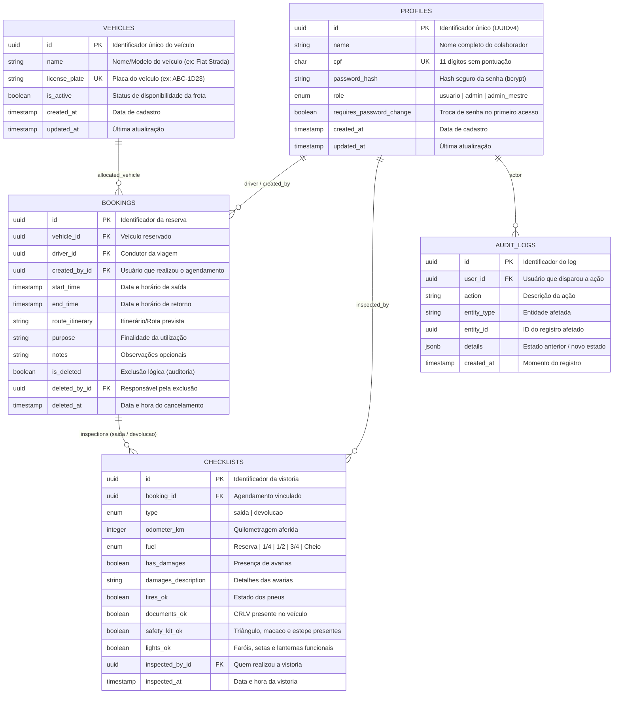

# Arquitetura do Banco de Dados EcoFrotas (Supabase / PostgreSQL)

Este documento descreve a arquitetura relacional completa projetada para suportar o sistema **EcoFrotas | Agendamento Veicular** no **Supabase**.

---

## 1. Diagrama Entidade-Relacionamento (ERD)



---

## 2. Dicionário de Dados

### 2.1. Tabela `profiles` (Usuários / Colaboradores)
| Coluna | Tipo | Nulo? | Padrão | Descrição |
|---|---|---|---|---|
| `id` | `UUID` | Não | `uuid_generate_v4()` | Chave primária. |
| `name` | `VARCHAR(150)` | Não | - | Nome completo do usuário. |
| `cpf` | `CHAR(11)` | Não | - | CPF (apenas números, 11 dígitos, único). |
| `password_hash` | `TEXT` | Não | - | Senha criptografada (bcrypt). |
| `role` | `user_role` | Não | `'usuario'` | Papel: `'usuario'`, `'admin'` ou `'admin_mestre'`. |
| `requires_password_change` | `BOOLEAN` | Não | `true` | Força a troca de senha no primeiro login. |
| `created_at` | `TIMESTAMPTZ` | Não | `now()` | Registro de criação. |
| `updated_at` | `TIMESTAMPTZ` | Não | `now()` | Registro de alteração. |

### 2.2. Tabela `vehicles` (Frota)
| Coluna | Tipo | Nulo? | Padrão | Descrição |
|---|---|---|---|---|
| `id` | `UUID` | Não | `uuid_generate_v4()` | Chave primária. |
| `name` | `VARCHAR(100)` | Não | - | Descrição do carro (ex.: Fiat Strada Branca). |
| `license_plate` | `VARCHAR(10)` | Não | - | Placa do veículo em maiúsculas (única). |
| `is_active` | `BOOLEAN` | Não | `true` | Se está disponível para novos agendamentos. |
| `created_at` | `TIMESTAMPTZ` | Não | `now()` | Data de cadastro. |

### 2.3. Tabela `bookings` (Reservas / Agendamentos)
| Coluna | Tipo | Nulo? | Padrão | Descrição |
|---|---|---|---|---|
| `id` | `UUID` | Não | `uuid_generate_v4()` | Chave primária. |
| `vehicle_id` | `UUID` | Não | - | FK para `vehicles.id`. |
| `driver_id` | `UUID` | Não | - | FK para `profiles.id` (quem conduzirá). |
| `created_by_id` | `UUID` | Não | - | FK para `profiles.id` (quem agendou). |
| `start_time` | `TIMESTAMPTZ` | Não | - | Data e hora de início da viagem. |
| `end_time` | `TIMESTAMPTZ` | Não | - | Data e hora de término da viagem. |
| `route_itinerary` | `TEXT` | Não | - | Trajeto/itinerário obrigatório. |
| `purpose` | `VARCHAR(255)` | Não | - | Motivo/objetivo da viagem. |
| `notes` | `TEXT` | Sim | `NULL` | Observações adicionais. |
| `is_deleted` | `BOOLEAN` | Não | `false` | Exclusão lógica (mantém auditoria). |
| `deleted_by_id` | `UUID` | Sim | `NULL` | FK para `profiles.id` que cancelou. |
| `deleted_at` | `TIMESTAMPTZ` | Sim | `NULL` | Data e hora da exclusão. |

### 2.4. Tabela `checklists` (Vistorias)
| Coluna | Tipo | Nulo? | Padrão | Descrição |
|---|---|---|---|---|
| `id` | `UUID` | Não | `uuid_generate_v4()` | Chave primária. |
| `booking_id` | `UUID` | Não | - | FK para `bookings.id` (ON DELETE CASCADE). |
| `type` | `checklist_type` | Não | - | `'saida'` ou `'devolucao'`. |
| `odometer_km` | `INTEGER` | Não | - | Quilometragem registrada. |
| `fuel` | `fuel_level` | Não | - | `'Reserva'`, `'1/4'`, `'1/2'`, `'3/4'`, `'Cheio'`. |
| `has_damages` | `BOOLEAN` | Não | `false` | Se há danos na lataria/pintura. |
| `damages_description` | `TEXT` | Sim | `NULL` | Descrição das avarias encontradas. |
| `tires_ok` | `BOOLEAN` | Não | `true` | Pneus em bom estado. |
| `documents_ok` | `BOOLEAN` | Não | `true` | CRLV no veículo. |
| `safety_kit_ok` | `BOOLEAN` | Não | `true` | Macaco, triângulo e estepe presentes. |
| `lights_ok` | `BOOLEAN` | Não | `true` | Faróis, lanternas e setas operacionais. |
| `inspected_by_id` | `UUID` | Não | - | FK para `profiles.id`. |
| `inspected_at` | `TIMESTAMPTZ` | Não | `now()` | Timestamp da vistoria. |

---

## 3. Garantia de Integridade e Concorrência (ACID)

Para evitar que dois usuários agendem o mesmo veículo no mesmo horário (condição de corrida):
1. **Trigger PostgreSQL**: `trg_prevent_booking_conflict` é acionado em `BEFORE INSERT OR UPDATE` na tabela `bookings`.
2. O trigger roda a verificação:
   ```sql
   start_time < NEW.end_time AND end_time > NEW.start_time
   ```
3. Caso exista sobreposição em agendamento ativo (`is_deleted = false`), o PostgreSQL bloqueia a transação imediatamente com `RAISE EXCEPTION`.

---

## 4. Passo a Passo para Implantação no Supabase

Quando você criar o novo projeto no Supabase:
1. Acesse o dashboard do seu projeto no Supabase: [https://supabase.com/dashboard](https://supabase.com/dashboard).
2. No menu lateral esquerdo, clique em **SQL Editor**.
3. Clique em **New query**.
4. Copie todo o conteúdo do arquivo [`supabase/schema.sql`](file:///c:/Users/Lenovo/Desktop/agendar%20carros/supabase/schema.sql) e cole no editor.
5. Clique em **Run** (ou pressione `Ctrl+Enter`).
6. Todas as tabelas, tipos enums, índices, triggers de validação e políticas RLS serão criadas automaticamente.

---

## 5. Próxima Etapa: Conectar o Frontend ao Supabase

O frontend já foi modularizado em camadas (`src/services/storage/`). Para chavear do modo offline (`localStorage`) para o Supabase:
1. Instalar o client: `npm install @supabase/supabase-js`.
2. Adicionar as variáveis no arquivo `.env`:
   ```env
   VITE_SUPABASE_URL=https://seu-projeto.supabase.co
   VITE_SUPABASE_ANON_KEY=sua-chave-anon
   ```
3. O repositório de dados já possui métodos assíncronos que mapeiam 1:1 com as tabelas criadas.
